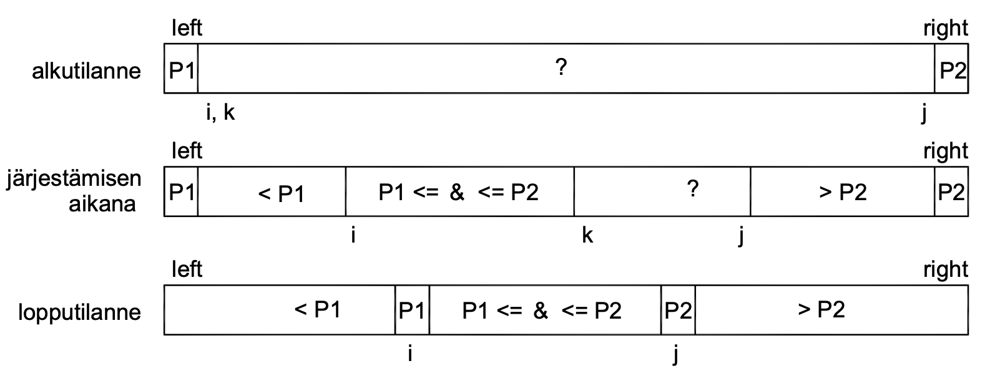

# Multi Pivot Quicksort

Quicksort is perhaps the most popular sorting algorithm. It works with any type of data and is usually the fastest method, especially with large input sets. Quicksort is the main sorting algorithm in many programming environments (Java, C++).

During the last ten years, there have been new developments in quicksort algorithms, which have increased efficiency substantially. Multi pivot quicksort algorithms are already in common use, but better algorithms are still being developed.

This study examines different quicksort algorithms and the dependence of their efficiency on different factors. When evaluating algorithm efficiency, it is also necessary to take into account how well the algorithm utilizes computer's resources. It has been shown that the increase in efficiency of multi pivot quicksort algorithms is mostly due to the efficiency of cache usage and not so much to the speed of the algorithms.

Empirical tests were carried out using different quicksort methods. The results of the tests are similar to the published theoretical and experimental results of different methods. Theoretical studies show that the optimum number of pivots is four or five. The number of pivots is limited by the difficulty of optimal choice of dividing elements.

The empirical tests were coded using C++ programming language version C++11.
## Dokumentaatio

[Classic quicksort](https://github.com/lautanal/quicksort/blob/master/dokumentaatio/classic.md)

[Dual Pivot Quicksort](https://github.com/lautanal/quicksort/blob/master/dokumentaatio/dualpivot.md)

[Three Pivot Quicksort](https://github.com/lautanal/quicksort/blob/master/dokumentaatio/threepivot.md)

[Five Pivot Quicksort](https://github.com/lautanal/quicksort/blob/master/dokumentaatio/fivepivot.md)

[Empirical Tests](https://github.com/lautanal/quicksort/blob/master/dokumentaatio/testdocument.md)

[Source Code](https://github.com/lautanal/quicksort/blob/master/src)

[User Manual](https://github.com/lautanal/quicksort/blob/master/dokumentaatio/usermanual.md)
