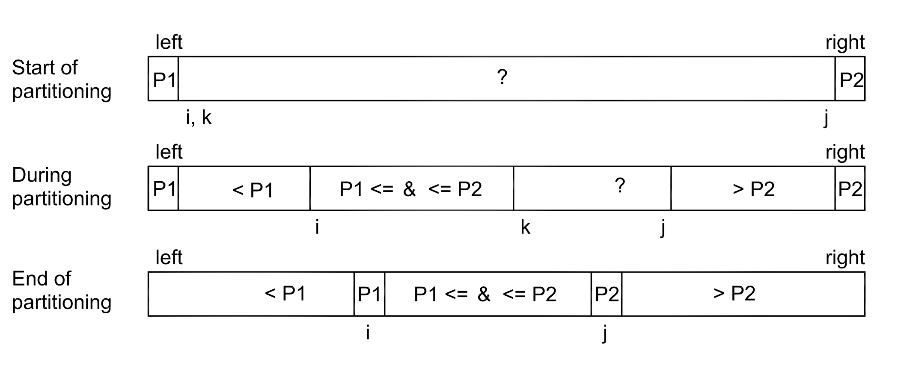

# Multi Pivot Quicksort

Quicksort is perhaps the most popular sorting algorithm. It works with any type of data and is usually the fastest method, especially with large input sets. Quicksort is the main sorting algorithm in many programming environments (Java, C++).

During the last ten years, there have been new developments in quicksort algorithms, which have increased efficiency substantially. Classic quicksort algorithm sorts a table according to a single element.  Modern quicksort methods an have multiple dividing elements, i.e. pivots.
 
This study examines different quicksort algorithms and their efficiency depending on different factors. When evaluating algorithm efficiency, it is also necessary to take into account how well the algorithm utilizes computer resources. It has been shown that the increase in efficiency of modern quicksort algorithms comes mostly due to the efficient use of cache memory and not so much due to algorithmic efficiency.

Empirical tests were carried out using different quicksort methods. The results of the tests are similar to the published theoretical and experimental results of different methods. Theoretical studies show that the optimum number of dividing elements (pivots) is four or five. The number of pivots is limited by the difficulty of optimal choice of pivot elements.

The empirical tests were coded using C++ programming language version C++11.
## Documentation

[Classic quicksort](https://github.com/lautanal/quicksort/blob/master/documentation/classic.md)

[Dual Pivot Quicksort](https://github.com/lautanal/quicksort/blob/master/documentation/dualpivot.md)

[Three Pivot Quicksort](https://github.com/lautanal/quicksort/blob/master/documentation/threepivot.md)

[Five Pivot Quicksort](https://github.com/lautanal/quicksort/blob/master/documentation/fivepivot.md)

[Empirical Tests](https://github.com/lautanal/quicksort/blob/master/documentation/testdocument.md)

[Source Code](https://github.com/lautanal/quicksort/blob/master/src)

[User Manual](https://github.com/lautanal/quicksort/blob/master/documentation/usermanual.md)
