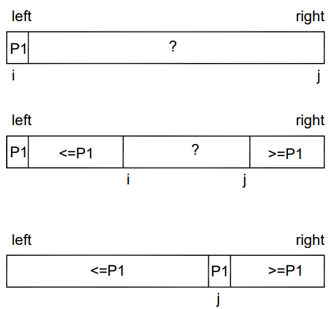
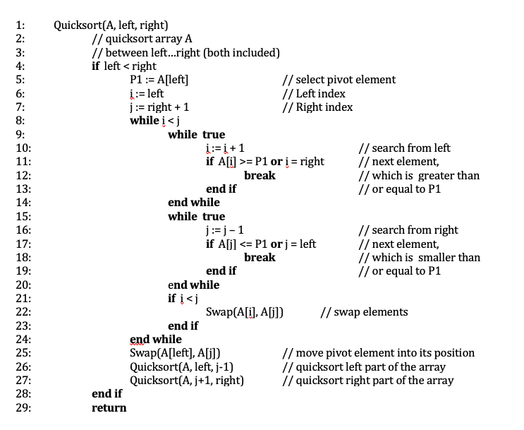

# Classic Quicksort

The principle of classic quicksort is to divide a table into two parts, based on a dividing element (pivot). The elements of the table are compared to the pivot element and are arranged in such a way that elements smaller than the pivot element are on the left side of it, larger elements are on the right side of it, and elements of equal size can be on either side (Figure).

Dividing a table into two parts can be done in several different ways. Any element can be selected as the pivot element, and there are also many ways to swap elements. Below is Sedgewick's partitioning algorithm in pseudocode, where the first element of the range to be sorted, i.e. the element at left, is always selected as the pivot element.

The file [src/quicksort_classic.h](https://github.com/lautanal/quicksort/blob/master/src/quicksort_classic.h) has a similar implementation in C++.