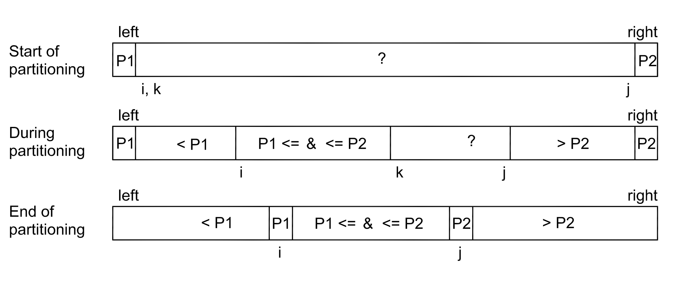
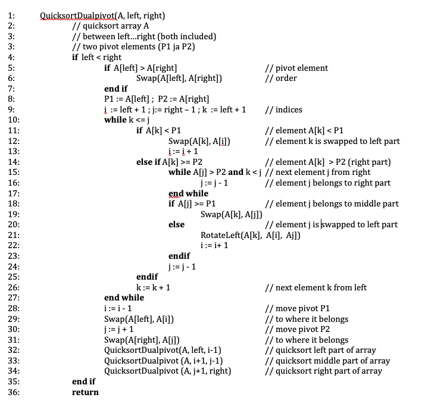

# Dual Pivot Quicksort

In dual pivot quicksort, any two elements of a table can be selected as pivot elements.  For example the first and the last element of the set can be selected as pivot elements. These are marked with P 1 and P 2 (picture), of which P 1 is the smaller dividing element.

The set to be sorted is reviewed and its elements are divided into three subsets. Items smaller than P 1 are placed at the beginning of the array. Elements larger than P 2 are placed at the end. Elements that are between or equal in size to the pivot elements are placed in the middle (Yaroslavskiy, 2009).

The three subsets obtained in this way are processed recursively with the same algorithm until the whole array is in order. Yaroslavskiy's partitioning algorithm of two pivot elements is described below in pseudocode.

The file [src/quicksort_dualpivot.h](https://github.com/lautanal/quicksort/blob/master/src/quicksort_dualpivot.h) has an implementation in C++.