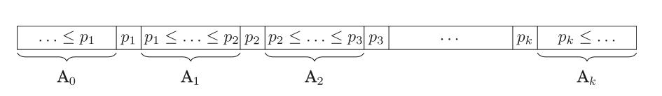
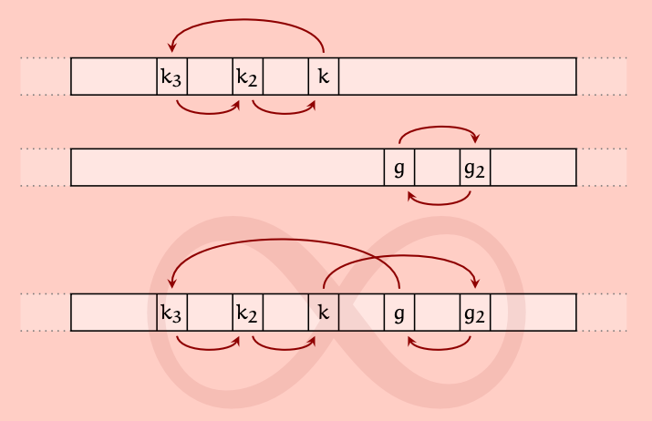

# Five Pivot Quicksort

Multi-pivot quicksort algorithms have usually an odd number of pivots. The five- and seven-pivot methods are further developments of the three-pivot algorithm.
An element is first compared to the middle pivot, so it is decided which side of the table the element belongs to. After that, the comparison with other pivot elements is continued until the exact place of the element in the partitioning is known.

Swaps and transfers between elements are usually carried out in rotations of several elements, thereby minimizing the number of element operations (picture below)

There is an implementation in C++ in the file [src/quicksort_fivepivot.h](https://github.com/lautanal/quicksort/blob/master/src/quicksort_fivepivot.h).
