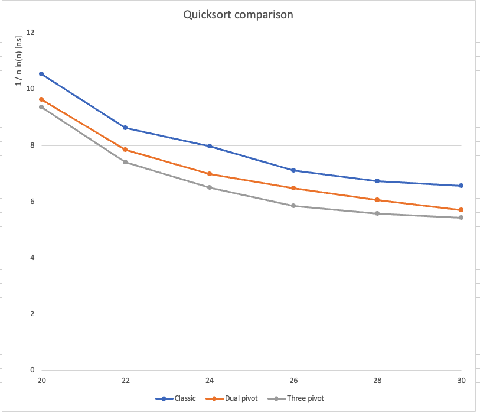

## Empirical tests

### Programs

Programs written in C++ were used to empirically measure the efficiency of quicksort algorithms with one, two and three pivot elements.
The programs are located in the src folder. The programs are mainly based on published pseudocodes (Wild and Aumüller and Dietzfelbinger)

The algorithms used are basic versions. The selection of pivot elements has not been optimized, they are always selected in the same way from standard positions. Only insertion sort is enabled when the size of the subarray is below a certain limit.
I believe that by optimizing the algorithms, efficiency could be improved by several tens of percent.

### Running Time Study

The test computer used was a MacBook Pro with a 2.5 GHz Intel Core i7 processor and 16 GB of RAM. The measurements involved sorting randomly generated integer arrays of various sizes, ranging from 2^10 - 2^30 (1,024 to 1,073,741,824 elements).

The results of the time complexity comparisons are largely consistent with previously published findings (figure). However, efficiency depends significantly on the architecture of the computer used for comparisons, making direct comparisons with other studies challenging.

According to the tests, the dual-pivot algorithm is approximately 10% faster than classic QuickSort. Meanwhile, the three-pivot algorithm is about 6–7% more efficient than the dual-pivot method.

### Efficiency Meters

The number of different algorithmic operations was counted in the empirical tests. The counted operations were:

• number of comparisons between elements (comparisons)

• number of element write accesses (write accesses)

• number of element scans (element scans)

Instead of element swaps, the number of element write commands has been calculated, because the positions of elements are changed mainly in rotations of several elements.

The operations in which a new element is taken into sorting process are counted as element scans. In practice, this happens when any of the program indeces pointing to a table element changes its position. In the dual pivot algorithm there are three place indices, and in the 3-pivot algorithm there are four indeces. A movenment of any of the indices increases the number of element scans by one.

The number of element operations are measured with random integer tables of a billion elements (unsigned integer, range 1 – 4,000,000,000). The measured operation numbers are quite close to the theoretical averages published by Aumüller. The results are in the table below.

Kushagra et al. and Wild have shown that the speed of sorting algorithms depends above all on the number of element manipulations (scans). The achieved results support this claim.

