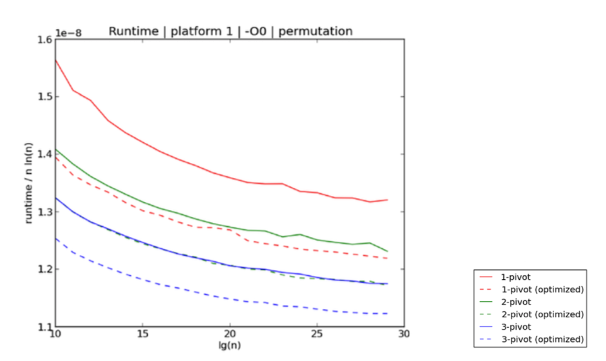
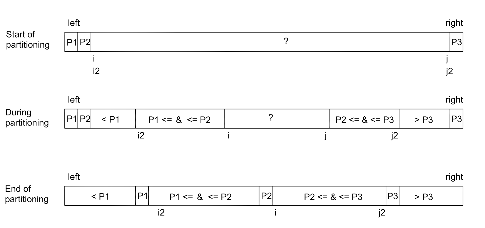

# Three Pivot Quicksort

Kushagra et al. showed that increasing the number of pivot elements can further improve the efficiency of quicksort. Based on empirical experiments, the three-pivot algorithm can achieve a 7-9% improvement compared to the dual-pivot algorithms in use (picture above)

In the algorithm proposed by Kushagra et al., three pivot elements are selected from the array, for example, the first, second, and last elements. These pivots are then arranged in order of magnitude.

Each element in the array is first compared to the middle pivot and then to one of the other two pivots. This allows the elements to be divided into four subarrays based on their values, which are then processed recursively (see figure below).

The file [src/quicksort_threepivot.h](https://github.com/lautanal/quicksort/blob/master/src/quicksort_threepivot.h) has an implementation in C++.
