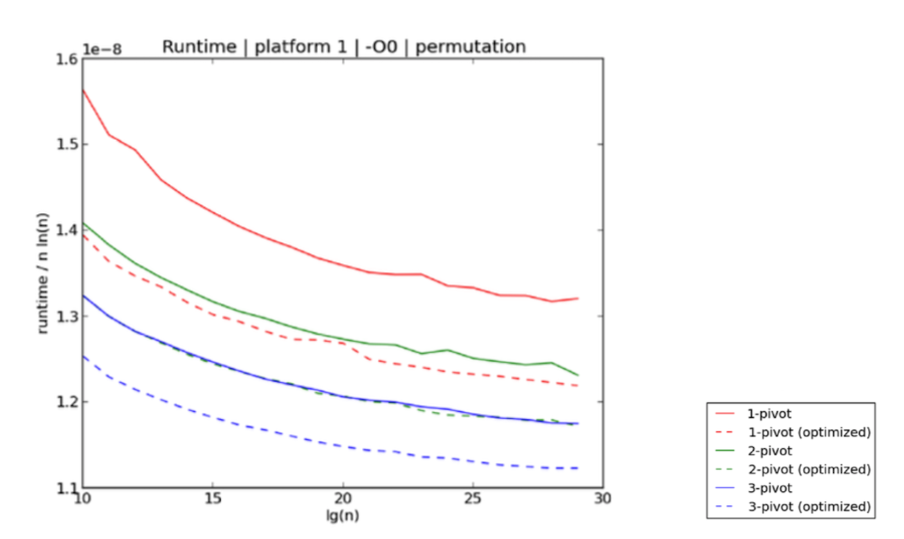
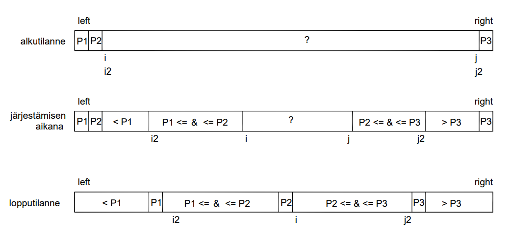

# Kolmen jakoalkion pikajärjestäminen

Kushagra et al. osoittivat, että jakoalkioiden määrää kasvattamalla voidaan edelleen parantaa pikajärjestämisen tehokkuutta. Kolmen jakoalkion algoritmilla voidaan saavuttaa empiiristen kokeiden perusteella 7-9% parannus verrattuna käytössä oleviin kahden jakoalkion algoritmeihin

Kushagran et al. ehdottamassa algoritmissa joukosta valitaan kolme jakoalkiota, esimerkiksi ensimmäinen, toinen ja viimeinen alkio. Nämä laitetaan suuruusjärjestykseen. Kutakin joukon alkiota verrataan ensiksi keskimmäiseen jakoalkioon ja sen jälkeen vielä toiseen kahdesta muusta jakoalkiosta. Joukon alkiot voidaan näin jakaa suuruuden perusteella neljään osajoukkoon, joiden käsittelyä jatketaan rekursiivisesti (kuva).

Tiedostossa [src/quicksort_threepivot.h](https://github.com/lautanal/quicksort/blob/master/src/quicksort_threepivot.h) on vastaava toteutus C++ -kielellä.
