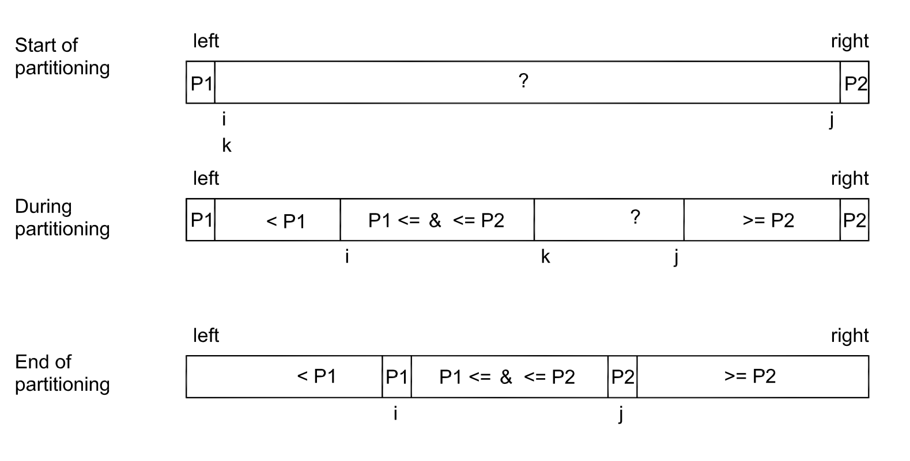
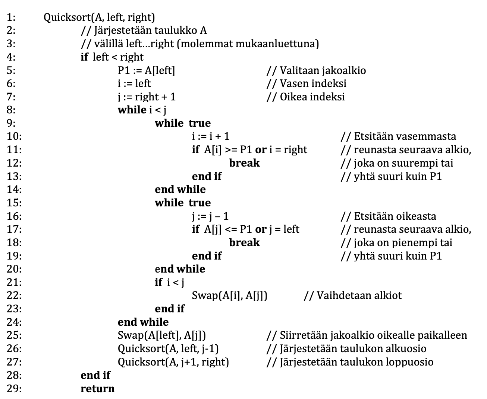

# Klassinen yhden alkion pikajärjestäminen

Klassisen pikajärjestämisen periaatteena on jakaa taulukko kahteen osaan ns. jakoalkion (pivot) perusteella. Taulukon alkioita verrataan jakoalkioon ja ne järjestetään siten, että jakoalkiota pienemmät alkiot ovat sen vasemmalla puolella, suuremmat alkiot sen oikealla puolella ja yhtä suuret alkiot voivat olla kummalla puolella tahansa (Kuva 2.1).

Taulukon jako kahteen osaan voidaan toteuttaa usealla eri tavalla. Jakoalkioksi voidaan valita mikä tahansa alkio ja lisäksi on monia tapoja siirtää alkioita. Alla on Sedgewickin ositusalgoritmi pseudokoodina, jossa jakoalkioksi valitaan aina järjestettävän välin ensimmäinen eli kohdassa left oleva alkio.

Tiedostossa [quicksort_classic.h](https://github.com/lautanal/quicksort/blob/master/src/quicksort_classic.h) on C++ vastaava toteutus C++ -kielellä.
