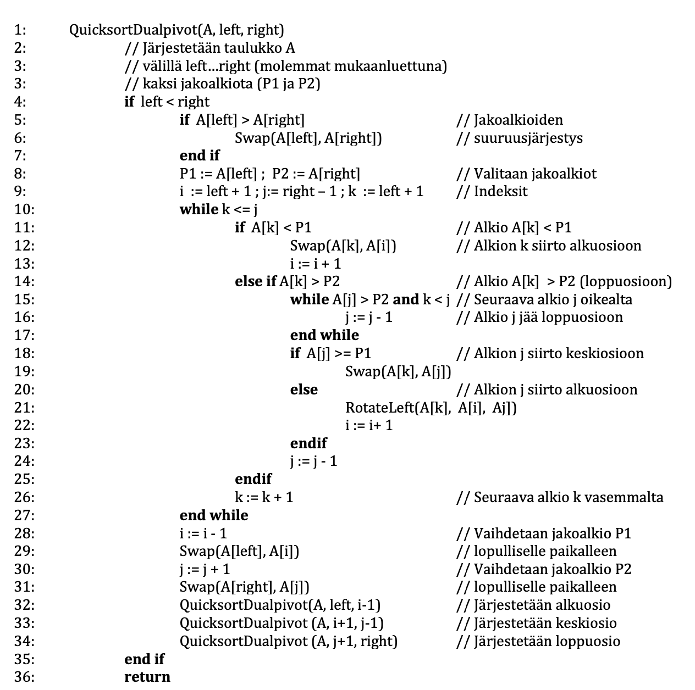

# Kahden jakoalkion pikajärjestäminen

Kahden jakoalkion pikajärjestämisessä jakoalkioiksi voidaan valita esimerkiksi joukon ensimmäinen ja viimeinen alkio. Näistä voidaan käyttää merkintöjä P 1 ja P 2 (kuva), joista P 1 on pienempi jakoalkio.

Järjestettävä joukko käydään läpi ja sen alkiot jaetaan kolmeen osajoukkoon. Alkiot, jotka ovat pienempiä kuin P 1 sijoitetaan joukon alkuun. Alkiot, jotka ovat suurempia kuin P 2 sijoitetaan loppuun. Alkiot, jotka ovat suuruudeltaan jakoalkioiden välillä, tai yhtäsuuria, sijoitetaan keskelle (Yaroslavskiy, 2009).

Kolme näin saatua osajoukkoa käsitellään rekursiivisesti samalla algoritmilla, kunnes koko oukko on järjestyksessä. Alla on kuvattu Yaroslavskiyn kahden jakoalkion ositusalgoritmi pseudokoodina.

Tiedostossa [dualpivot.h](https://github.com/lautanal/quicksort/blob/master/src/dualpivot.h) on vastaava toteutus C++ -kielellä.
