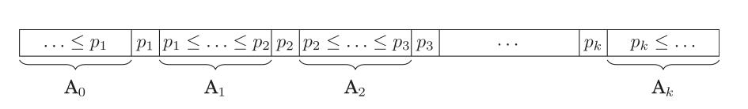
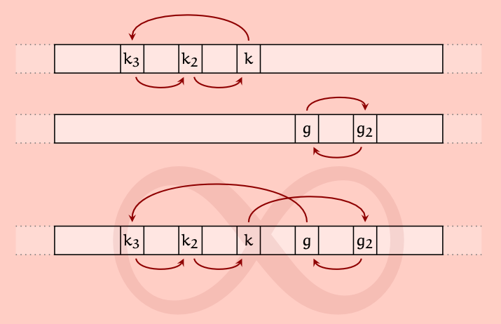

# Viiden jakoalkion pikajärjestäminen

Usean jakoalkion algoritmeissa käytetään yleensä parittomia määriä jakoalkioita. Viiden ja seitsemän jakoalkion menetelmät ovat jatkokehitelmiä kolmen jakoalkion algoritmista.
Alkiota verrataan ensiksi keskimmäiseen jakoalkioon, jolloin tiedetään kummalle puolelle taulukkoa alkio kuuluu. Sen jälkeen jatketaan vertailua muihin jakoalkioihin, kunnes tiedetään alkion tarkka paikka osituksessa.

Alkioiden väliset siirrot toteutetaan yleensä usean alkion rotaatioina, jolloin minimoidaan alkioiden käsittelyjen määrä (kuva alla)

Tiedostossa [src/quicksort_fivepivot.h](https://github.com/lautanal/quicksort/blob/master/src/quicksort_fivepivot.h) on eräs toteutus C++ -kielellä.
