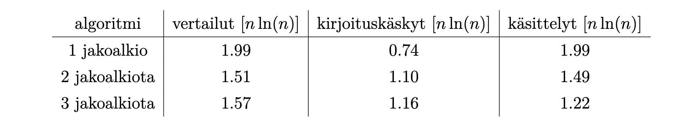

## Empiiriset kokeet

### Ohjelmat

Kirjoitin kanditutkielmaa varten C++ -ohjelmia, joilla eri algoritmien tehokkuutta voidaan mitata empiirisesti. Ohjelmilla voidaan vertailla yhden, kahden ja kolmen jakoalkion algoritmeja toisiinsa.
Ohjelmat löytyvät kansiosta src. Ohjelmat perustuvat pääosin julkaistuihin pseudokoodeihin (Wild ja Aumüller ja Dietzfelbinger)

Käytetyt algoritmit ovat ns. perusversioita. Jakoalkioiden valintaa ei ole optimoitu, ne valitaan aina samalla tavalla vakiopaikoista. Ainoastaan lisäysjärjestäminen otetaan käyttöön, kun osataulukon koko pienenee tietyn rajan alle.
Algoritmien optimoinnilla voitaisiin käsittääkseni saada vielä usean kymmenen prosentin arannus tehokkuuteen

### Ajoaikakokeet

Testikoneena käytettiin Macbook Pro tietokonetta, jossa on 2.5GHz Intel Core I7 -prosessori ja 16GB keskusmuistia. Mittauksissa järjestettiin eri kokoisia satunnaiskokonaislukutaulukoita. Taulukoiden koko vaihteli välillä 210 − 230 (1 024 − 1 073 741 824).
Aikavaativuusvertailujen tulokset ovat varsin hyvin yhtäpitävät aikaisemmin julkaistujen tulosten kanssa (kuva). Tehokkuus riippuu toki paljon vertailuissa käytetyn tietokoneen arkkitehtuurista, joten suora vertailu toisiin tutkimuksiin on vaikeaa.

Kahden jakoalkion algoritmi on testien mukaan noin 10% klassista pikajärjestämistä nopeampi. Kolmen jakoalkion algoritmi on puolestaan noin 6–7% parempi kuin kahden jakoalkion menetelmä.

### Tehokkuusmittarit

Testeissä laskettiin myös ohjelmallisesti algoritmien tekemien operaatioiden määrät. Laskettuja suureita olivat:

• alkioiden välisten vertailujen määrä (comparisons)

• alkioiden kirjoituskäskyjen määrä (write accesses)

• alkioiden käsittelyjen määrä (element scans)

Alkioiden vaihtojen (swaps) sijaan on laskettu alkioiden kirjoituskäskyjen määrä, koska alkioiden paikat vaihdetaan pääasiassa usean alkion rotaatioina. Alkioiden kirjoituksia tulee luonnollisesti melkein kaksi kertaa niin paljon kuin vaihtoja. Alkioiden käsittelyiksi lasketaan ne operaatiot, joissa uusi taulukon alkio otetaan käsittelyyn. Käytännössä tämä tapahtuu ohjelmassa silloin, kun joku taulukon alkioihin osoittavista indekseistä muuttaa paikkaa. Kahden jakoalkion algoritmissa on kolme paikan indeksiä ja kolmen jakoalkion algoritmissa neljä indeksiä. Niistä jokaisen siirto kasvattaa alkioiden käsittelyjen määrää yhdellä.

Operaatiomäärien mittaukset on tehty miljardin alkion satunnaiskokonaislukutaulukoilla (unsigned integer, vaihteluväli 1 – 4 000 000 000). Mitatut operaatiomäärät ovat melko lähellä Aumüllerin (2016) julkaisemia teoreettisia keskiarvoja. Tulokset ovat allaolevassa taulukossa.

Kushagra et al. ja Wild ovat esittäneet, että järjestämisalgoritmien nopeus riippuu ennen kaikkea alkioiden käsittelyjen määrästä.  Saavutetut tulokset tukevat tätä väittämää.

