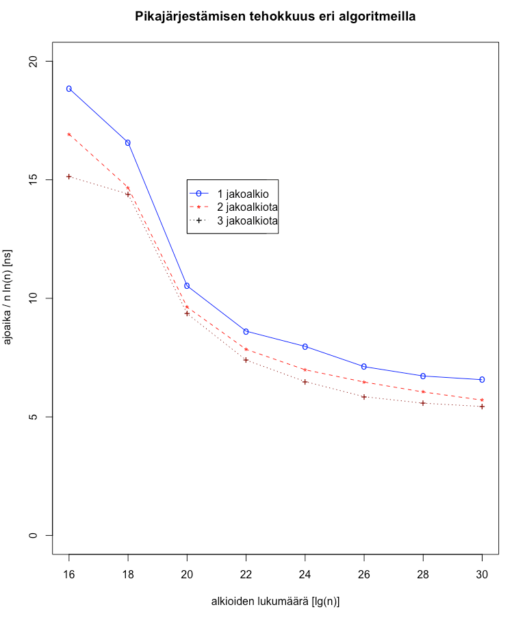

## Empirical tests

### Programs

I wrote C++ programs that can be used to empirically measure the efficiency of different algorithms. The programs can be used to compare algorithms with one, two and three pivot elements.
The programs are located in the src folder. The programs are mainly based on published pseudocodes (Wild and Aumüller and Dietzfelbinger)

The algorithms used are basic versions. The selection of pivot elements has not been optimized, they are always selected in the same way from standard positions. Only insertion sort is enabled when the size of the subarray is below a certain limit.
I believe that by optimizing the algorithms, efficiency could be improved by several tens of percent.

### Running Time Study

A Macbook Pro computer with a 2.5GHz Intel Core I7 processor and 16GB of RAM memory was used in the empirical tests. Random integer tables of different sizes were sorted in the tests. The size of the tables varied between 2^10 − 2^30 (1,024 − 1,073,741,824).
The results agree quite well with the previously published results (picture). Of course, the efficiency depends a lot on the architecture of the computer used in the comparisons, so a direct comparison with other studies is difficult.

According to the tests, the two pivot algorithm is about 10% faster than the classic quicksort. The algorithm with three pivots is about 6–7% better than the method with two pivots.

### Efficiency Meters

In the empirical tests, the number of different algorithm operations was counted. The counted operations were:

• number of comparisons between elements (comparisons)

• number of element write accesses (write accesses)

• number of element scans (element scans)

Instead of element swaps, the number of element write commands has been calculated, because the positions of elements are changed mainly in rotations of several elements.

The operations in which a new table element is taken into process are counted as element scans. In practice, this happens when any of the program indexes pointing to a table element changes its position. In the two pivot algorithm there are three place indices, and in the 3-pivot algorithm there are four indexes. The movenment of any of the indices increases the number of element scans by one.

The number of element operations are measured with random integer tables of a billion elements (unsigned integer, range 1 – 4,000,000,000). The measured operation numbers are quite close to the theoretical averages published by Aumüller. The results are in the table below.

Kushagra et al. and Wild have shown that the speed of sorting algorithms depends above all on the number of element manipulations. The achieved results support this claim.

